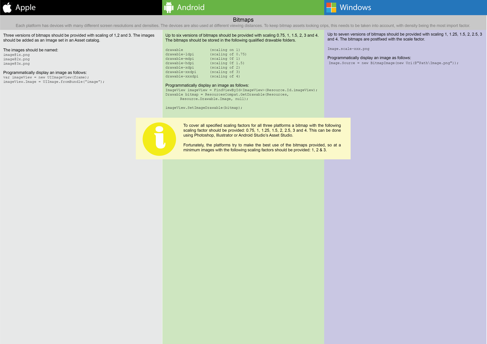

# Introduction
Digital transformation is the buzzword, and everybody is trying to do it. The technological playing field is a complicated place with organisations needing to deliver empowering apps to their clients, useful line of business applications to their employees, and APIs for integration with their business partners. The complication is only going to worse with the arrival of more technology platforms. Samsung is pushing Tizen and augmented reality devices are imminent.
To target the major platforms: Android; iOS; Windows and the Web you need to know the following.
* XCode, Swift, iOS and foundations.
* Android Studio, Android, Java and the Java class libraries.
* Visual Studio, WPF, C# and the .NET base class library.
* Your IDE of choice for HTML, CSS, JavaScript with some server side technology.

This is onerous and many enterprises are collapsing under their own technological weight, they are left stuck with no agility at all.
Microsoft understands this problem and is addressing it with the purchase of Xamarin and the .NET standard 2.0 initiative. .NET Standard 2.0 will be implemented by .NET Framework, .NET Core, and Xamarin. With this the technology stack is reduced to:
* Visual Studio
* Android, iOS, UWP, web (HTML, CSS, JavaScript)
* .NET standard 2.0 

Microsoft is working on Xamarin Forms to further simplify the Android, iOS and UWP portion of the stack. This simplified stack can give an enterprise a competitive advantage with its digital transformation in today’s technologically driven world.
Even so there is still a lot to know to develop applications for Android, iOS and the UWP. This projects is attempting to deliver a set of cheat sheet posters to give developers an overview of these Android, iOS and WUP.

A set of posters with details of the three main development platforms: Android; iOS and WUP.

# Accompanying Apps
The repo contains an accompanying App for each platform. The Apps are used to verify the content of the posters and used to provide screen shots.

# Posters
The project is still in the very early stages of development. These are the posters in their current state.

